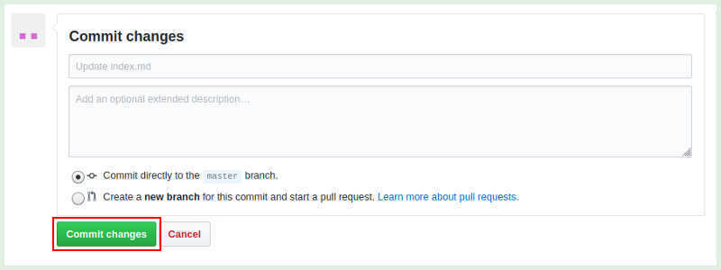

 

    Login user - <b>the-user-you-are</b>.

 

GitHub Pages are public webpages.
They are hosted and easily published through GitHub.
You can use Github for free.

The quickest way to get up using a pre-made theme. 
You can then modify your gitHub page via the web.

### Step 1
I registered a new user named `the-user-you-are`
<a href="https://github.com/join" target="_blank">on Github</a>

### Step 2
Once you’ve signed in, you’ll create a new repository.
You need to give this repository a special name: `the-user-you-are.github.io`.

### Step 3
#### Now enter the settings menu

#### ...and roll down to GitHub Pages

#### ...Choose a theme... my favorite is the MINIMAL theme ...Select theme...

### Step 4
There is a button at the bottom of the page to post the changes: `Commit changes`

### Step 5
After commiting your site is published at 
<a href="https://the-user-you-are.github.io/" target="_blank">https://the-user-you-are.github.io/</a>

## You have done! Your site is published. Modify it! Have fun!

